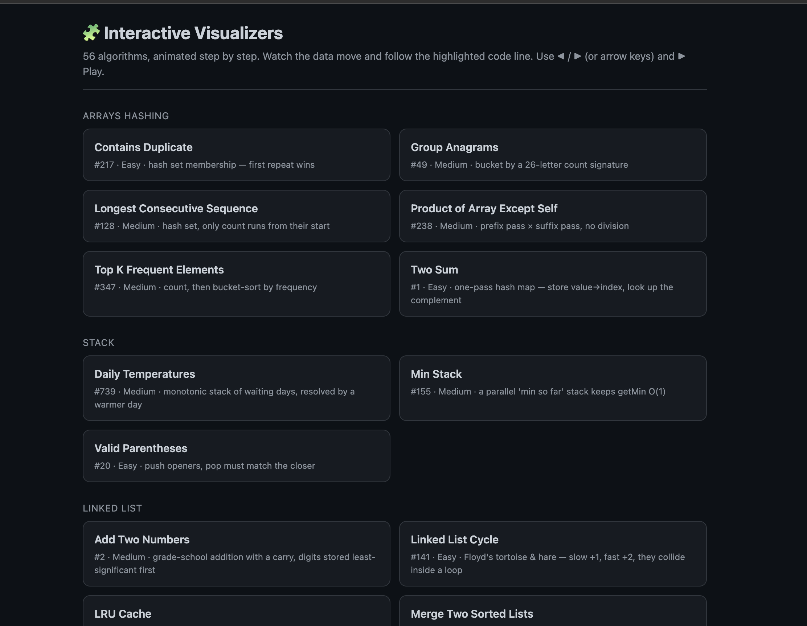
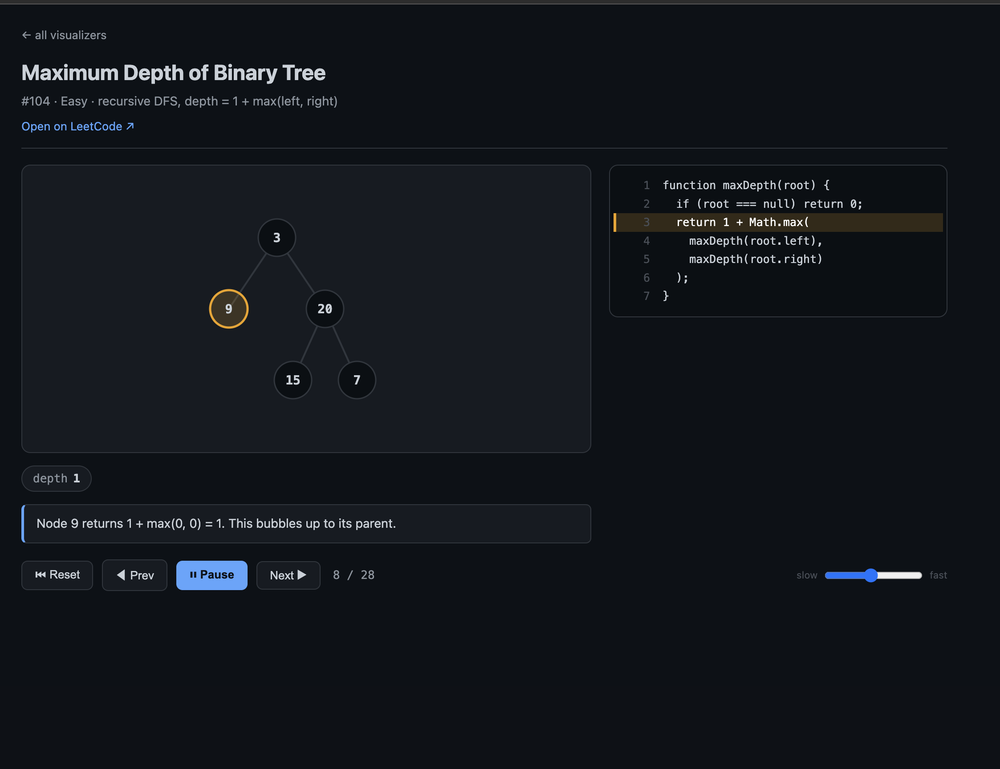

# LeetCode in TypeScript — Data Structures 🧩

A curated, hands-on collection of classic **data-structure & algorithm** interview
problems (based on the [Blind 75](https://neetcode.io/practice/practice/blind75) /
[NeetCode 150](https://neetcode.io/practice/practice/neetcode150) lists and the
[haoel/leetcode](https://github.com/haoel/leetcode) reference repo), solved in
**TypeScript** and organized **by data structure / technique**.

**56 problems** spanning Easy → Hard across 14 categories — every one
type-checked, runnable, and paired with an **interactive visualizer**.



Every problem lives in its own folder with three files:

| File | Purpose |
|------|---------|
| `solution.ts` | A typed, **runnable** solution with a small demo at the bottom. |
| `README.md`   | The **idea**, a step-by-step walkthrough, an ASCII visual, and **time/space complexity**. |
| `visualize.html` | An **interactive, animated** walkthrough (open [`index.html`](index.html) or `./run.sh -v <name>`). |

---

## 🚀 How to use this repo

```bash
npm install            # one-time: installs tsx + typescript
```

### Run ONE solution — `./run.sh`
A fuzzy runner so you never type full paths:

```bash
./run.sh                 # list all 56 problems, numbered
./run.sh lru             # fuzzy match -> runs 03-linked-list/lru-cache
./run.sh koko            # -> 11-binary-search/koko-eating-bananas
./run.sh 12              # run problem #12 from the list
./run.sh -w two-sum      # WATCH mode: re-runs automatically on every save
```

**Watch mode (`-w`) is the workflow for re-sharpening:** open a `solution.ts`,
rewrite it / drop in a `console.log`, hit save, and the output refreshes
instantly — no need to re-run anything.

```bash
# Type-check every solution at once:
npm run typecheck
```

### Interactive visualizers 🎬
**Every** problem ships an HTML visualizer that **animates the algorithm** step by
step, with a synced, line-highlighted code panel.

```bash
open index.html                 # the menu of all visualizers
./run.sh -v edit-distance       # open one problem's visualizer directly
```

See [**🎬 Interactive visualizers**](#-interactive-visualizers) below for what they
show, the controls, the renderers, and how to add your own.

### Where to put your own `console.log`
Each `solution.ts` ends with a demo block:

```ts
if (require.main === module) {
  // runs ONLY when you execute this file directly.
  // edit these calls, add console.log(...), throw in your own test cases:
  console.log(twoSum([2, 7, 11, 15], 9)); // [0, 1]
}
```

The guard means you can also `import` the function elsewhere without the demo
firing. Add logs anywhere — inside the function or this block — and re-run (or
let `-w` do it for you).

---

## 🎬 Interactive visualizers

All **56** problems ship a `visualize.html` that **animates the algorithm** —
zero dependencies, no build step, no server (they open straight off the file
system). Browse the gallery in [`index.html`](index.html), or jump to one with
`./run.sh -v <name>`.



### What you're looking at
- **Stage** (left) — the data structure at the current step: array cells, bars, a
  2-D table, a linked list, or a tree. Pointers, highlights, and the "active" cell
  update as you move through the run.
- **Code panel** (right) — the solution with the **currently executing line
  highlighted**, so you can map state ↔ code at a glance.
- **Caption** — one plain-English sentence describing the current step.
- **Chips** — auxiliary state that doesn't live in the main view (a running
  `best`, a hash map, a heap, a carry, the `low/high` bounds…).

### Controls
| Action | Button | Keyboard |
|--------|--------|----------|
| Step forward / back | `Next ▶` / `◀ Prev` | `→` / `←` |
| Play / pause | `▶ Play` | `space` |
| Restart | `⏮ Reset` | — |
| Speed | the slow ↔ fast slider | — |

### Renderers — and which problems use them
The engine ships five renderers; each problem picks whichever fits its data:

| Renderer | Looks like | Example problems |
|----------|-----------|------------------|
| **array** | a row of indexed cells with labelled pointer arrows + highlights | Two Sum, 3Sum, Binary Search, sliding windows, 1-D DP |
| **bars** | a bar chart of heights (with a shaded region) | Container With Most Water, Koko Eating Bananas |
| **grid** | a 2-D table that fills in cell by cell | Edit Distance, LCS, Unique Paths, Number of Islands, Word Search |
| **list** | linked-list nodes + arrows (reversed-pointer & cycle aware) | Reverse List, Linked List Cycle, LRU Cache |
| **tree** | an auto-laid-out binary / recursion tree | Invert Tree, Validate BST, Trie, Kth Smallest |

### How it works — and how to add one
Each `visualize.html` runs the **real algorithm** through a tiny *recorder*, so
the animation can never drift from the logic. You feed `Viz.create` the code to
display and a `build(rec)` that calls `rec.step(...)` at each interesting moment:

```html
<link rel="stylesheet" href="../../viz/viz.css">
<script src="../../viz/viz.js"></script>
<script>
Viz.create({
  title: "Two Sum",
  subtitle: "#1 · Easy · one-pass hash map",
  url: "https://leetcode.com/problems/two-sum/",
  code: ["function twoSum(nums, target) {", "  // ...", "}"],  // shown line-by-line
  build(rec) {
    // run the algorithm; record a frame at each step:
    rec.step({
      line: 4,                         // 1-based line in `code` to highlight
      note: "need 9 − 2 = 7",          // caption
      aux: { seen: "{2:0}" },          // chips
      type: "array",                    // renderer + its fields:
      values: [2, 7, 11, 15], pointers: { i: 0 }, hi: [0],
    });
  },
});
</script>
```

Frames are plain JSON (the engine deep-clones each one), so stepping the algorithm
builds up the whole replay. The gallery is regenerated from every `visualize.html`
by `node viz/gen-index.mjs`. The whole engine is ~300 lines of dependency-free
vanilla JS in [`viz/viz.js`](viz/viz.js) + [`viz/viz.css`](viz/viz.css).

---

## 📈 Complexity cheat-sheet

`n` = input size. Big-O describes growth as `n → ∞`.

| Notation | Name | "Feels like" |
|----------|------|--------------|
| `O(1)` | constant | hash lookup, array index |
| `O(log n)` | logarithmic | binary search, balanced-tree descent |
| `O(n)` | linear | one pass over the data |
| `O(n log n)` | linearithmic | good sorts, heap of n items |
| `O(n²)` | quadratic | nested loops over the data |

---

## 🗂️ Index

### 01 · Arrays & Hashing
> Hash maps/sets trade **space for time**: O(1) average lookup turns many O(n²) scans into O(n).

- [x] [Two Sum](01-arrays-hashing/two-sum) · #1 · Easy
- [x] [Contains Duplicate](01-arrays-hashing/contains-duplicate) · #217 · Easy
- [x] [Group Anagrams](01-arrays-hashing/group-anagrams) · #49 · Medium
- [x] [Top K Frequent Elements](01-arrays-hashing/top-k-frequent-elements) · #347 · Medium
- [x] [Product of Array Except Self](01-arrays-hashing/product-of-array-except-self) · #238 · Medium
- [x] [Longest Consecutive Sequence](01-arrays-hashing/longest-consecutive-sequence) · #128 · Medium

### 02 · Stack
> LIFO. Perfect for matching pairs, "most recent" lookups, and monotonic scans.

- [x] [Valid Parentheses](02-stack/valid-parentheses) · #20 · Easy
- [x] [Min Stack](02-stack/min-stack) · #155 · Medium
- [x] [Daily Temperatures](02-stack/daily-temperatures) · #739 · Medium (monotonic stack)

### 03 · Linked List
> Pointers, not indices. Master the dummy node and the fast/slow two-pointer trick.

- [x] [Reverse Linked List](03-linked-list/reverse-linked-list) · #206 · Easy
- [x] [Merge Two Sorted Lists](03-linked-list/merge-two-sorted-lists) · #21 · Easy
- [x] [Linked List Cycle](03-linked-list/linked-list-cycle) · #141 · Easy (Floyd's)
- [x] [Add Two Numbers](03-linked-list/add-two-numbers) · #2 · Medium
- [x] [Remove Nth Node From End of List](03-linked-list/remove-nth-node-from-end-of-list) · #19 · Medium
- [x] [LRU Cache](03-linked-list/lru-cache) · #146 · Medium (hash map + doubly linked list)

### 04 · Queue & Deque
> FIFO. Backbone of BFS; the deque powers sliding-window extremes.

- [x] [Implement Queue using Stacks](04-queue/implement-queue-using-stacks) · #232 · Easy

### 05 · Trees (Binary Tree & BST)
> Recursion mirrors structure. DFS for shape, BFS for levels, BST invariant for order.

- [x] [Invert Binary Tree](05-trees/invert-binary-tree) · #226 · Easy
- [x] [Maximum Depth of Binary Tree](05-trees/maximum-depth-of-binary-tree) · #104 · Easy
- [x] [Binary Tree Level Order Traversal](05-trees/binary-tree-level-order-traversal) · #102 · Medium (BFS)
- [x] [Validate Binary Search Tree](05-trees/validate-binary-search-tree) · #98 · Medium
- [x] [Kth Smallest Element in a BST](05-trees/kth-smallest-element-in-a-bst) · #230 · Medium
- [x] [Lowest Common Ancestor of a BST](05-trees/lowest-common-ancestor-of-a-bst) · #235 · Medium

### 06 · Heap / Priority Queue
> A binary heap keeps the min/max at the root in O(log n) per push/pop.

- [x] [Kth Largest Element in a Stream](06-heap-priority-queue/kth-largest-element-in-a-stream) · #703 · Easy
- [x] [Last Stone Weight](06-heap-priority-queue/last-stone-weight) · #1046 · Easy
- [x] [K Closest Points to Origin](06-heap-priority-queue/k-closest-points-to-origin) · #973 · Medium

### 07 · Trie (Prefix Tree)
> A tree keyed by characters. Prefix queries in O(length), independent of dictionary size.

- [x] [Implement Trie (Prefix Tree)](07-trie/implement-trie-prefix-tree) · #208 · Medium
- [x] [Design Add and Search Words](07-trie/design-add-and-search-words) · #211 · Medium

### 08 · Graphs
> Nodes + edges. BFS/DFS to explore, topological sort to order dependencies.

- [x] [Number of Islands](08-graphs/number-of-islands) · #200 · Medium
- [x] [Clone Graph](08-graphs/clone-graph) · #133 · Medium
- [x] [Rotting Oranges](08-graphs/rotting-oranges) · #994 · Medium (multi-source BFS)
- [x] [Course Schedule](08-graphs/course-schedule) · #207 · Medium (topological sort)
- [x] [Course Schedule II](08-graphs/course-schedule-ii) · #210 · Medium (topological sort)

### 09 · Two Pointers
> Two indices moving toward each other (or in tandem) collapse many O(n²) scans to O(n).

- [x] [3Sum](09-two-pointers/3sum) · #15 · Medium
- [x] [Container With Most Water](09-two-pointers/container-with-most-water) · #11 · Medium

### 10 · Sliding Window
> A window whose ends only move forward — O(n) answers for "best contiguous substring/subarray".

- [x] [Longest Substring Without Repeating Characters](10-sliding-window/longest-substring-without-repeating-characters) · #3 · Medium
- [x] [Longest Repeating Character Replacement](10-sliding-window/longest-repeating-character-replacement) · #424 · Medium

### 11 · Binary Search
> Halve the search space each step — on sorted arrays *and* on the answer itself.

- [x] [Search in Rotated Sorted Array](11-binary-search/search-in-rotated-sorted-array) · #33 · Medium
- [x] [Find Minimum in Rotated Sorted Array](11-binary-search/find-minimum-in-rotated-sorted-array) · #153 · Medium
- [x] [Koko Eating Bananas](11-binary-search/koko-eating-bananas) · #875 · Medium (search on the answer)

### 12 · Backtracking
> DFS over partial solutions with choose → recurse → un-choose. Subsets, combos, permutations, grids.

- [x] [Subsets](12-backtracking/subsets) · #78 · Medium
- [x] [Combination Sum](12-backtracking/combination-sum) · #39 · Medium
- [x] [Permutations](12-backtracking/permutations) · #46 · Medium
- [x] [Word Search](12-backtracking/word-search) · #79 · Medium

### 13 · Intervals
> Sort by start (or end), then sweep once. The backbone of scheduling problems.

- [x] [Merge Intervals](13-intervals/merge-intervals) · #56 · Medium
- [x] [Insert Interval](13-intervals/insert-interval) · #57 · Medium
- [x] [Non-overlapping Intervals](13-intervals/non-overlapping-intervals) · #435 · Medium (greedy)

### 14 · Dynamic Programming
> Break a problem into overlapping subproblems, solve each once, store the result. Define **state → recurrence → base case**, then fill the table.

- [x] [Climbing Stairs](14-dynamic-programming/climbing-stairs) · #70 · Easy (DP intro)
- [x] [House Robber](14-dynamic-programming/house-robber) · #198 · Medium (1-D decision)
- [x] [Maximum Subarray](14-dynamic-programming/maximum-subarray) · #53 · Medium (Kadane's)
- [x] [Coin Change](14-dynamic-programming/coin-change) · #322 · Medium (unbounded knapsack, min)
- [x] [Longest Increasing Subsequence](14-dynamic-programming/longest-increasing-subsequence) · #300 · Medium
- [x] [Word Break](14-dynamic-programming/word-break) · #139 · Medium (prefix DP)
- [x] [Unique Paths](14-dynamic-programming/unique-paths) · #62 · Medium (grid DP)
- [x] [Longest Common Subsequence](14-dynamic-programming/longest-common-subsequence) · #1143 · Medium (2-D string DP)
- [x] [Edit Distance](14-dynamic-programming/edit-distance) · #72 · Hard (2-D string DP)
- [x] [Coin Change II](14-dynamic-programming/coin-change-ii) · #518 · Medium (counting knapsack)

---

## 🧠 Reusable building blocks

Some problems reuse the same node types. They're defined inline in each file
(so you can paste straight into LeetCode), but conceptually:

```ts
class ListNode { val: number; next: ListNode | null; }
class TreeNode { val: number; left: TreeNode | null; right: TreeNode | null; }
class MinHeap<T> { push(x: T): void; pop(): T | undefined; peek(): T | undefined; }
```

Happy practicing! Start at [Two Sum](01-arrays-hashing/two-sum) and work down.
